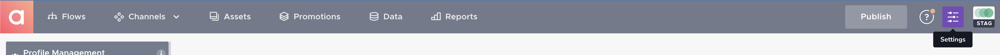
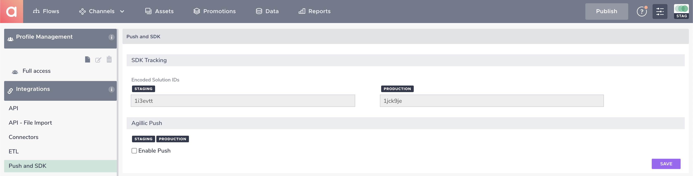
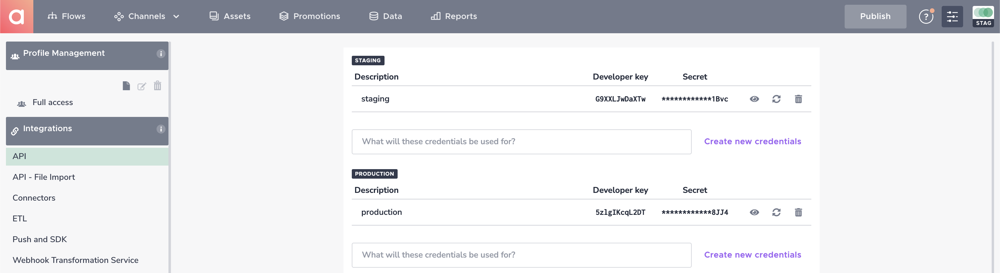
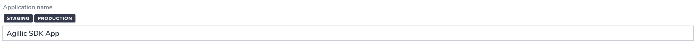
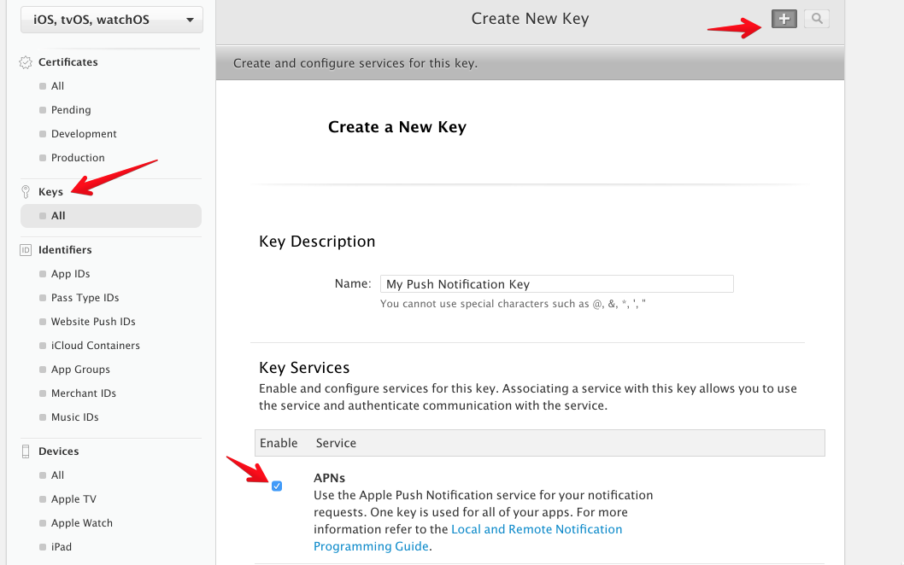
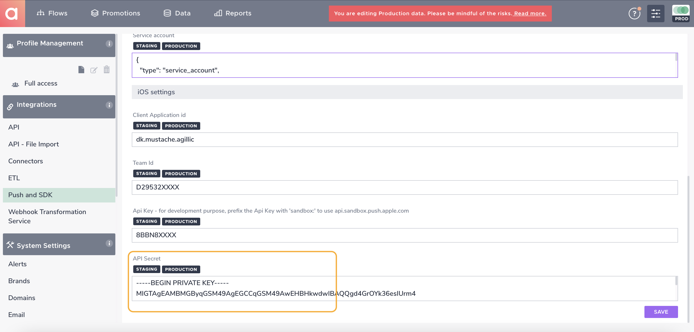
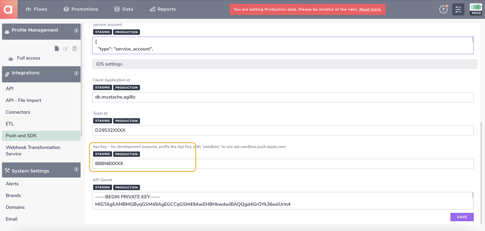

# Configuration of the Agillic Solution

## Introduction

This section will help you to configure the Agillic Solution an 
obtain the keys and id's you need to be able configure and initialize
the AgillicMobileSDK into your iOS application.

---

To get started, login to your Agillic Solution and select **Settings** in the top right corner.

<div align = "center"></div>

## SDK Configuration

In order to configure the SDK in your iOS application you will need to reference yous Agillic Solution:
* ```solutionId```
* ```apiKey```
* ```apiSecret```

### Where to find them

Click **Push and SDK** in the left sidebar to view your staging and production solution IDs.

<div align = "center"></div>

Click **API** in the left sidebar to view or create a developer key and secret.

* Note the `Developer Key` is the `apiKey` in the Agillic SDK
* Note the `Secret` is the `apiSecret` in the Agillic SDK

<div align = "center"></div>


## Setup Push Notifications for iOS

Next, select **Push and SDK** in the left pane Menu, under **Integrations** and check the "enable push" checkbox
<div align = "center"></div>

##### Enter application name
This is the name of your application (typically what it says in the AppStore)

<div align = "center"></div>

##### Enter Client Application id
This has to correspond to the Bundle identifier of your iOS application (**VERY IMPORTANT**)
<div align = "center"></div>


### iOS Authentication Token

The Agillic Soltion uses the ios Authentication Token to connect to Apple Push Notificaion services.

- Read more [Authentication Tokens](https://developer.apple.com/library/content/documentation/NetworkingInternet/Conceptual/RemoteNotificationsPG/CommunicatingwithAPNs.html#//apple_ref/doc/uid/TP40008194-CH11-SW1)
- Go to [Member Center](https://developer.apple.com/account/ios/certificate/distribution/create)

## Enter credentials into you Agillic Solution

* Create a `Key` for Push Nonotification and Download as `.p8` file.
* Open any text editer and copy/paste the content of the `.p8` file into your `Api Secret`
<table>
  <tr>
    <td></td>
    <td>
  </td>
  </tr>
</table>

* Note your `Key ID` and Enter into the `Api Key` field
<table>
  <tr>
    <td></td>
    <td>
  </td>
  </tr>
</table>


* Note your `Team ID` In your [Account Membership](https://developer.apple.com/account/#/membership) and Enter into the `Team ID` field
<table>
  <tr>
    <td></td>
    <td>
  </td>
  </tr>
</table>


Now your are good to go!
